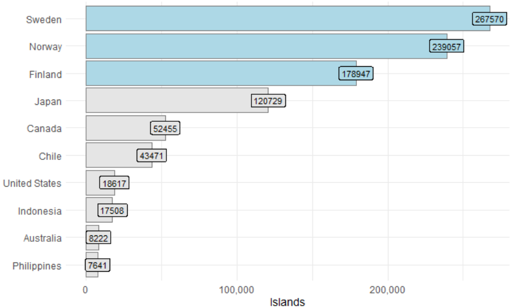
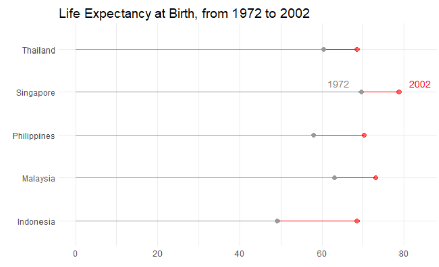

>
"<em> A most gruesome and nerve-racking assignment to finish as my last module with SUSS in exchange for the master's certificate </em>"  

This repository contains the class materials for ANL501 Data Visualisation and Storytelling, a course offered by the Master of Analytics and Visualisation (MAVI) programme at SUSS. Thanks to all current and past students whose feedback has contributed to improving the course.

Data Scraping from Wiki using Reticulate    |  Lollipop Chart on Life Expectancy
:-------------------------:|:-------------------------:
 |   

In this course, we explore the use of R programming to construct data visualizations. The course follows <a href="https://socviz.co/"> Data Visualization: A Practical Introduction </a> by Kieran Healy and the course introduction can be found here [<a href="https://nicholas-sim.github.io/ANL501-Data-Visualisation-and-Storytelling/seminar_1/"> Seminar 1 </a>]. While no prerequisites are required, some exposure to programming would be beneficial for students. Nevertheless, before going into data visualizations, we will introduce R and ensure everyone is proficient in working with and manipulating data frames using it. You may access the lecture slides below. The course is structured as follows:

**Introduction to R Programming**

  1. R Operations [<a href="https://nicholas-sim.github.io/ANL501-Data-Visualisation-and-Storytelling/seminar_1/"> Seminar 1 </a>]
  1. R Programming [<a href="https://nicholas-sim.github.io/ANL501-Data-Visualisation-and-Storytelling/seminar_1/"> Seminar 1 </a>]
  1. Data Management in Base R [<a href="https://nicholas-sim.github.io/ANL501-Data-Visualisation-and-Storytelling/seminar_2/"> Seminar 2 </a>]
  1. Data Management in Tidyverse  [<a href="https://nicholas-sim.github.io/ANL501-Data-Visualisation-and-Storytelling/seminar_2/"> Seminar 2 </a>]
     

**Data Storytelling Principles**

  1. Data Storytelling Practices [<a href="https://nicholas-sim.github.io/ANL501-Data-Visualisation-and-Storytelling/seminar_1/"> Seminar 1 </a>]
  2. Principles of Data Storytelling and the Grammar of Graphics [<a href="https://nicholas-sim.github.io/ANL501-Data-Visualisation-and-Storytelling/seminar_2/"> Seminar 2 </a>]
  3. Storyboarding for Data Visualization [<a href="https://nicholas-sim.github.io/ANL501-Data-Visualisation-and-Storytelling/seminar_6/"> Seminar 6 </a>]

**Data Visualizations**

  1. Getting Started with ggplots [<a href="https://nicholas-sim.github.io/ANL501-Data-Visualisation-and-Storytelling/seminar_3/"> Seminar 3 </a>]
  2. Data Preprocessing for Data Visualization
  3. Plotting Trends and Time Series: Line Charts, Area Charts, Path Plots [<a href="https://nicholas-sim.github.io/ANL501-Data-Visualisation-and-Storytelling/seminar_4/"> Seminar 4 </a>]
  4. Plotting Distributions : Bar Plots, Histograms, Kernel Density Plots [<a href="https://nicholas-sim.github.io/ANL501-Data-Visualisation-and-Storytelling/seminar_4/"> Seminar 4 </a>]
  5. Comparing Distributions : Column Plots, Box Plots, Dot Plots, Jitter Plots, Tree Maps [<a href="https://nicholas-sim.github.io/ANL501-Data-Visualisation-and-Storytelling/seminar_5/"> Seminar 5 </a>]
  6. Improving Data Storytelling: Labels and Annotations [<a href="https://nicholas-sim.github.io/ANL501-Data-Visualisation-and-Storytelling/seminar_5/"> Seminar 5 </a>]
  7. Plotting Geospatial Data: Choropleth Maps [<a href="https://nicholas-sim.github.io/ANL501-Data-Visualisation-and-Storytelling/seminar_5/"> Seminar 5 </a>]

**Other Topics**

  1. RMarkdown for Reproducible Report for Analytics [<a href="https://nicholas-sim.github.io/ANL501-Data-Visualisation-and-Storytelling/seminar_4/"> Seminar 4 </a>]
  2. Integrating Python with R using Reticulate (various parts in <a href="https://nicholas-sim.github.io/ANL501-Data-Visualisation-and-Storytelling/seminar_4/"> Seminar 4 </a> and <a href="https://nicholas-sim.github.io/ANL501-Data-Visualisation-and-Storytelling/seminar_5/"> Seminar 5 </a>)
  3. Further Issues in Geospatial Visualization (*ggmap*, plotting various shape files) [<a href="https://nicholas-sim.github.io/ANL501-Data-Visualisation-and-Storytelling/seminar_6/"> Seminar 6 </a>]
  4. Interactive Geospatial Plots with Leaflet [<a href="https://nicholas-sim.github.io/ANL501-Data-Visualisation-and-Storytelling/seminar_6/"> Seminar 6 </a>]
  5. Webscrapping with API
  6. Creating a Data Visualization Portfolio on Github

