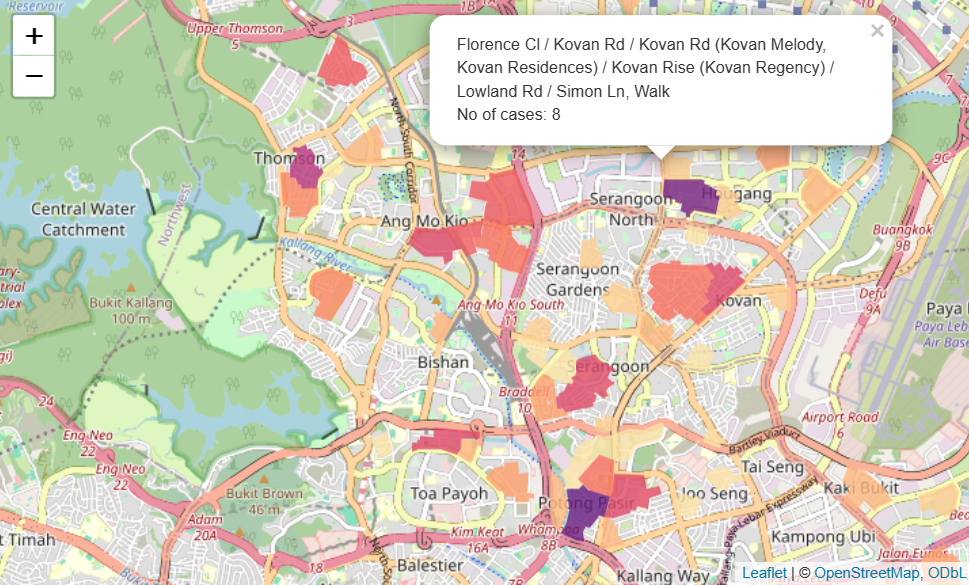

	

This repository contains my class materials for ANL501 Data Visualisation and Storytelling offered by the Master of Analytics and Visualisation.

In this course, we employ R to construct data visualizations. Before we take a dive into ggplots, we first cover some intro to R:

**Introduction to R Programming**
 
1. Getting Started with R - Basic Operations
2. Getting Started with R - Programming
3. Data Management with Base R
4. Data Management with Tidyverse

After an overview on ggplots, we explore how to construct various visualizations for different data types. These visualizations are:

**Constructing Data Visualizations**

6. Categorical Data - Bar Plots
7. Numerical Cross-Sectional Data - Histograms, Tree Maps
8. Time Series Data - Line and Area Charts and Path Plots
9. Geospatial Data - Choropleth Maps
10. Others - Leaflet

